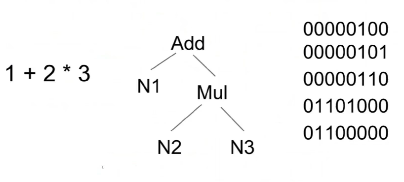

<head>
<link rel="stylesheet" type="text/css" href="resumen.css">
</head>

# Grammatical Framework
[Grammatical Framework](http://www.grammaticalframework.org/) (GF) es un lenguaje de programación diseñado para escribir gramáticas multilingües.
Inspirado por la construcción de compiladores se basa en la definición de una sintaxis abstracta y mapeos entre la sintaxis abstracta y lenguajes concretos.
Creado por [Aarne Ranta](http://www.cse.chalmers.se/~aarne/), Profesor de Ciencias de la Computación en la Universidad de Gotemburgo.
GF fue creado en 1998 en [Xerox Research Centre Europe](http://www.xrce.xerox.com/), Grenoble, en el proyecto Multilingual Document Authoring.

### GF es:
* Un lenguaje de propósito específico en gramáticas, como [YACC](http://dinosaur.compilertools.net/yacc/), [Bison](https://www.gnu.org/software/bison/), [Happy](https://www.haskell.org/happy/), [BNFC](http://bnfc.digitalgrammars.com/).
* Un lenguaje de programación funcional, como [Haskell](https://www.haskell.org/), [Lisp](https://en.wikipedia.org/wiki/Lisp_(programming_language)), [OCaml](http://ocaml.org/), [SML](http://www.smlnj.org/), [Scheme](http://schemers.org/).
* Una plataforma de desarrollo para gramáticas de lenguaje natural, como [LKB](http://moin.delph-in.net/LkbTop), [XLE](http://www2.parc.com/isl/groups/nltt/xle/), [Regulus](http://www.issco.unige.ch/en/research/projects/regulus/news.shtml).
* Un formalismo de gramáticas categoriales, como [ACG](http://calligramme.loria.fr/acg/), [CCG](http://openccg.sourceforge.net/).
* Un framework lógico, como [Agda](http://wiki.portal.chalmers.se/agda/pmwiki.php), [Coq](https://coq.inria.fr/), [Isabelle](http://www.cl.cam.ac.uk/research/hvg/Isabelle/), equipado con sintaxis concreta en adición a lógica.
* Una plataforma para traducción automática, como [Moses](http://www.statmt.org/moses/), [Apertium](https://es.wikipedia.org/wiki/Apertium).

### Licencias y disponibilidad

GF es de código abierto, con licencia [GPL](http://www.grammaticalframework.org/LICENSE) para el programa y [LGPL](http://www.grammaticalframework.org/LICENSE), [BSD](http://www.grammaticalframework.org/LICENSE) para las liberías. 
Está disponible en:

* Linux
* Mac OS X
* Windows
* Android (via Java)
* Javascript (via compilación)

## ¿Por qué gramáticas? 

### Tradición vs. GF

Tradicionalmente las gramáticas de lenguaje natural han sido vistas únicamente como parte de la teoría lingüística. 
GF sugiere un punto de vista más computacional, diferente al de las gramáticas tradicionales, el cual puede ser visto como "compilación de lenguaje natural", basado en los fundamentos de construcción de compiladores, teniendo en cuenta que los compiladores han sido un caso exitoso del uso de gramáticas.

### Precisión vs. robustez

La implementación de gramáticas ofrece una gran precisión en la traducción de lenguajes, teniendo como desventaja una pérdida en la cantidad de frases aceptadas. 
Los métodos estadísticos poseen, al contrario, mayor robustez pero con dificultades de conseguir la misma precisión que las gramáticas.
Tomando como trabajo la traducción de lenguaje natural a un lenguaje formal, como el de la lógica de primer orden y pensando además en una posible utilización de la herramienta en un ámbito educativo, parece oportuno priorizar la precisión de la traducción antes que la cobertura.
Para trabajar con la herramienta y lidiar con el hecho de no cubrir algunas oraciones de lenguaje natural, la implementación contará con algun método de completado de frases, al estilo tab-completion, para la construcción guiada de frases correctas para la gramática. 
Como trabajo futuro podría ser interesante construir un sistema híbrido, con el objetivo de unir la gramática definida con herramientas estadísticas y lograr así un sistema más robusto.

### GF como un lenguaje de programación

Las gramáticas en GF son vistas como programas declarativos capaces de:

* parsear
* generar
* traducir

GF es un lenguaje de programación avanzado y de alto nivel, permitiendo:

* Programación funcional: Una forma abstracta y compacta de escribir gramáticas.
* Funciones de alto orden.
* Tipos dependientes.
* Type-checking estático: Gramáticas compiladas.
* Pattern matching sobre constructores de datos.
* Sistema de modulos con herencia y modulos parametrizados.


### Resource Grammar Library (RGL)
GF cuenta además con una librería llamada [RGL](http://www.grammaticalframework.org/lib/doc/synopsis.html) (Resource Grammar Library) que provee inflexiones morfológicas y reglas sintácticas de varios lenguajes (actualmente 32), incluído el español.

La RGL maneja de manera inteligente la morfología de la mayoría de estos lenguajes.
Un caso donde puede aprovecharse esto es que la librería defina automáticamente las variaciones de una palabra analizando la morfología de la misma.

Por ejemplo, en inglés un verbo regular como talk, genera automáticamente sus diferentes inflexiones:

```
mkV : Str -> V
mkV "talk" => talk, talks, talked, talked, talking
```

Esto permite la construcción de un lexicón solo dando una única forma de cada palabra.

### Diagrama de funcionamento de GF

El funcionamento de GF está inspirado fuertemente por el funcionamento de compiladores. 

El modelo puede resumirse como un "Multi-source Multi-target compiler".


## Sintaxis abstracta y concreta

### Sintaxis abstracta

La sintaxis abstracta formaliza la semántica esencial que es común a todos los lenguajes.
Se construye mediante una gramática abstracta, definiendo los posibles árboles de sintaxis abstractos (AST).

En la sintaxis abstracta se definen:

* Categorías (cat): Que serán los tipos de los AST.

* Funciones (fun) sobre las categorías definidas. Estas funciones son las que definen los AST.

### Sintaxis concreta
La sintaxis concreta es definida mediante mapeos entre la sintaxis abstracta y diferentes lenguajes concretos.
Con estas herramientas es posible parsear sentencias en algún lenguaje definido por la gramática concreta, y además linealizar desde un árbol abstracto, es decir, generar sentencias en algún lenguaje concreto.
GF permite una gramática abstracta en conjunto a varias gramáticas concretas, de esta manera posibilitando la traducción entre distintos lenguajes.

En la sintaxis concreta se definen:

* Categorías de linealización (lincat): Son los tipos concretos que se le asignan a cada categoría de la sintaxis abstracta. Por ejemplo, strings, records y tables.

* Linealización (lin) de los AST, teniendo en cuenta las categorías de linealización.

#### Un caso de uso pequeño
Ejemplo con expresiones aritméticas en Java:



Se desea compilar una expresión aritmética en Java a código binario de JVM. Para ello existe una sintaxis abstracta común para ambas notaciones y es posible generar un AST desde la expresión en Java y  además es posible generar una expresión en JVM desde el AST.
Se logra de esta manera una traducción desde Java a JVM.

Sintaxis Abstracta

	cat Exp ;
	fun Add : Exp -> Exp -> Exp ;

Sintaxis concreta (Java)

	lincat Exp = Str ;
	lin Add x y = x ++ "+" ++ y ;


Sintaxis concreta (JVM bytecode)

	lincat Exp = Str ;
	lin Add x y = x ++ y ++ "01100000" ;


## Compilando lenguaje natural

Para traducir entre varios lenguajes, normalmente sería necesario una traducción independiente para cada par de lenguajes.


Sin embargo, con GF la sintaxis abstracta juega el papel de "Interlingua", donde solo es necesario traducir entre cada lenguaje y la Interlingua.
A modo de ejemplo, si se desea traducir desde Español a Inglés, debe traducirse primero desde Español a la Interlingua, y luego desde la Interlingua al Inglés.
El caso inverso, es decir, traducir desde Inglés a Español, funciona de la misma manera.
Se puede decir entonces que con GF es posible realizar una compilación y decompilación de la misma manera.


### ¿Cómo se logra la traducción de lenguaje natural?

Sintaxis Abstracta:

```
fun Pred : NP -> VP -> S
fun Compl : V2 -> NP -> VP
```


Sintaxis concreta: (SVO)

```
lin Pred s vo = s ++ vo
lin Compl v o = v ++ o
```

Sintaxis concreta: (SOV)

```
lin Pred s vo = s ++ vo
lin Compl v o = o ++ v
```


### Records y tables

GF provee records y tables, además de strings, para definir la sintaxis concreta.


Se necesitan records para (VSO). No hay una manera de producir la linealización de la frase sin separar al predicado en dos partes (verbo y objeto), mediante un record.

Sintaxis concreta: (VSO)

```
lin Pred s vo = vo.verb ++ s ++ vo.obj
lin Compl v o = {verb = v ; obj = o}
```

Las modificaciones de una misma palabra o frase, como género, número, persona o polaridad requieren del uso de parámetros y tables.

Por ejemplo, en ingles un verbo puede variar según los siguientes modificadores de tiempo y persona.

```
param P = Inf | Sg3P | Past | PastPart | PresPart
```

Uso de tables:

```
lin Love = table {
    Inf => "love";
    Sg3P => "loves";
    Past | PastPart => "loved";
    PresPart => "loving";
}
```

### Concordancia en sintaxis concreta

Es importante notar que la sintaxis abstracta permanece sin cambios.

```
lin She = {
    s = table {Nom => "she" ; Acc => "her" };
    a = Sg3P;
}
```

```
lin Pred s vo = s.s ! Nom ++ vo ! s.a
lin Compl v o = table { a => v ! a ++ o.s ! acc };
```

```
Ejemplo: she loves her
```

### Parallel multiple context free grammars

GF usa internamente [Parallel multiple context free grammars (PMCFG)](http://www.sciencedirect.com/science/article/pii/030439759190374B), definidas como gramáticas ligeramente sensitivas al contexto. Lo que en GF puede pensarse de manera simple como gramáticas sobre tuplas. Un hecho interesante sobre PMCFG es que, al igual que las CGF, permite parsing polinomial. 

### Abstracción multilingüe

* Sintaxis abstracta
    * Estructura de árboles: Constituyentes y semántica.
* Sintaxis concreta
    * Palabras
    * Orden de palabras
    * Inflección
    * Concordancia

## Trabajo a realizar

El trabajo consiste en lograr traducir un fragmento de lenguaje natural a un lenguaje simbólico de lógica de primer orden.
Se tomó como motivación producir fórmulas lógicas para el programa [Sat](https://github.com/manugunther/sat).

Una de las ventajas de GF es que permite realizar una modularización paramétrica mediante funtores, los cuales admiten la definición de una gramática incompleta y la posibilidad de completarla con un lexicón. El objetivo es escribir una gramática incompleta de la manera más general posible, que abarque las diferentes construcciones del lenguaje formal de la lógica y luego poder instanciarla con diferentes lexicones, entre ellos, el de figuras geométricas de Sat.

### Motivación al trabajo

El primer desafío que se encuentra en el aprendizaje de la lógica está dado por la barrera lingüística impuesta por el lenguaje simbólico y artificial de la misma. Consecuentemente parece razonable comenzar un curso de lógica con la traducción de sentencias expresadas en lenguaje natural (digamos español) a su correspondiente formulación símbolica en la lógica en cuestión (proposicional, de primer orden, etc.). Las dificultades de esta traducción vienen dadas, entre otras, por la ambigüedad de la sentencia en lenguaje natural y por la puntillosidad con la que se deben construir las fórmulas lógicas.

El objetivo de este proyecto es extender el programa Sat con un módulo que permita a estudiantes la exploración de la traducción de lenguaje natural a fórmulas de lógica de primer orden y viceversa. De esta manera, la/el estudiante puede ir familiarizándose con la escritura formal a través de ejemplos que ella/el construye y contrastar su formalización con todas las traducciones posibles y viceversa. Esta traducción se basará teóricamente en la formalización de lenguaje natural utilizando [teoría de tipos propuesta por Ranta](https://books.google.com.ar/books?hl=sv&lr=&id=A5m13eGOcqYC&oi=fnd&pg=PA1&dq=aarne+ranta&ots=KjH2Put2Wa&sig=J__Gk-RZctvQzSqJBDVXyngpY1Y&redir_esc=y#v) y para la implementación se utilizará el Grammatical Framework.


# Trabajo realizado hasta el momento

# Explicación de la gramática

Se presenta a contuación las categorías y constructores más importantes de la gramática abstracta. Esta gramática es utiizada para poder parsear frases del español y poder traducirlas luego al lenguaje simbólico de fórmulas de primer orden. Se explica la razón de existencia de cada categoría y constructor.

# Categorías principales

| Categorías    | Descripción                     | Ejemplos                          |
| ------------- |:-------------------------------:|:---------------------------------:|
|    Prop       | proposición, compleja o atómica | A es rojo y B es grande           |
|    Atom       | propisición atómica             | A es rojo                         |
|    Pred1      | Predicado unario                | rojo                           |
|    Pred2      | Predicado binario               | está arriba de                    |
|    Ind        | término indivual                | A                                 |
|    Var        | variable de cuantificación      | x                                 |
|    Fun1       | función unaria                  | cuadrado (aritmética) e.g. x^2     |
|    Fun2       | función binaria                 | suma (aritmética) e.g. x+y         |
|    Conj       | conjunción                      | y, o                              |
|    Quant      | símbolo de cuantificación       | ∀, ∃                              |
| Kind          | dominio de cuantificación       | figura                            |

# Constructores de cada categoría

## Prop

Prop es la categoría usada para representar cualquier proposición de primer orden válida. Se debe tener en cuenta que habrá constructores más cercanos al lenguaje simbólico y otros más cercanos al lenguaje natural.
La razón de esto es usar los constructores más cercanos al lenguaje natural para parsear español, construyendo árboles abstractos de sintaxis (AST), que luego serán transformados mediante funciones de transferencia en AST formados por los constructores más cercanos al lenguaje simbólico, para así luego linealizarlos de manera directa en fórmulas de primer orden.

#### Proposiciones simples

* True : Prop
* False : Prop

Se usará True en el rango de cuantificación, por ejemplo al traducir: "cada figura es roja" en〈 ∀x : True : Rojo.x 〉


#### Proposiciones compuestas

##### Proposiciones atómicas:

* PAtom  : Atom  -> Prop ;

Proposiciones atómicas son aplicaciones de predicados 
unarios y binarios.

La restricción de aridad está dada en parte por SAT, ya que los predicados son únicamente unarios y binarios. Se podría generalizar la aridad, pero por el momento no se cree conveniente. Suposición: No es muy común en lenguaje natural predicados con aridad mayor.

* Ejemplo aridad 3: "entre", "A entre B y C"
(Aridad 3 podría llegar a ser útil en SAT)

* Ejemplos aridad >3 ?

Ejemplos:

* A es rojo
* A está arriba de B
* A es igual a B
* A es distinto de B


##### Negación de proposiciones:

* PNeg   : Prop  -> Prop ; 

Negación de proposiciones.

Ejemplo:

* no es el caso que A sea rojo

(No es muy natural en proposiciones atómicas, ver PNegAtom)

##### Negación atómica:

* PNegAtom  : Atom -> Prop ;

Negación de proposiciones atómicas. Se utiliza para aceptar frases negadas más naturales como:

* A no es rojo
* A no está arriba de B
* A no es igual B

##### Operadores binarios:

* PConj  : Conj  -> Prop -> Prop -> Prop ;
* PImpl  : Prop  -> Prop -> Prop ;

Ejemplos:

* A es rojo y B es azul
* si A es rojo entonces B está arriba de A
* si cada figura es roja entonces A es rojo

##### Cuantificación:

* PQuant  : Quant -> Var -> Prop -> Prop -> Prop ;

Cuantificación de la forma:

〈 Qx : R.x : T.x 〉

Está ligado fuertemente al lenguaje simbólico. No hay un fragmento de lenguaje natural que parsee directamente a un AST con esta categoría.
Se genera a través de funciones de transferencia desde cuantificación in-situ. (Ver UnivIS y ExistIS)

##### Cuantificación in-situ:

* UnivIS  : Var -> Kind -> Pred1 -> Prop ;
* ExistIS : Var -> Kind -> Pred1 -> Prop ; 

Se utilizan para parsear frases cuantificadas de lenguaje natural.
Notar que hay ciertas restricciones sobre el rango y término. El rango tiene categoría Kind (ver Kind). Esta categoría juega el papel de dominio de cuantificación y el término tiene categoria Pred1.

¿Por qué Kind y por qué Pred1?

Un primer itento de justificación es que la gramática está inspirada en el trabajo [Ranta gf-cade-2011](http://old-darcs.grammaticalframework.org/gf-cade-2011/code/).

La idea de cuantificación in-situ es aceptar frases naturales de la forma: "alguna [Kind] es [Pred1]" ó "cada [Kind] es [Pred1]".

Ejemplos:

* "alguna figura es roja"
* "alguna figura grande es roja"
* "alguna figura grande es roja o verde"

Esto tiene ciertas limitaciones, como por ejemplo, no poder usar predicados binarios en el término o en el rango (Ver constructores de Kind). Sin embargo ya veremos que la aplicación parcial de predicados binarios nos permitirá aceptar frases de la forma:

* "alguna figura está arriba de A"
* "alguna figura arriba de A es roja"

Con este modo de representar cuantificación in-situ siguen existiendo algunas limitaciones a resolver, como:

* Negaciones en rango y término
* Cuantificación anidada

Ejemplos de frases que se desearían aceptar:

* "alguna figura que no es roja está arriba de B"
* "alguna figura roja está arriba de alguna figura azul"
* "hay alguna figura roja arriba de alguna figura azul"

Pienso que estas limitaciones deberían ser resultas ya que suele ser bastante natural el uso de ambas construcciones en el lenguaje natural.


## Atom

Atom es la categoría usada para representar proposiciones atómicas.

##### Predicados 

* APred1 : Pred1 -> Ind -> Atom ;

* APred2 : Pred2 -> Ind -> Ind -> Atom ;

Estos son los constructores de proposiciones atómicas más comunes.

Su uso en lenguaje natural:

* A es rojo (Pred1)
* A es grande y verde (Ver ConjPred1)
* A está arriba de B
* A está arriba de B y C (Ver ConjInd)

##### Distributividad de predicado binario

* APred2Distr : (p : Pred2) -> Distr p -> [Ind] -> Atom

Permite la distributividad de un predicado binario en una lista de individuos.

Notar el uso del tipo dependiente Distr p, donde p es un predicado binario. (Leer el libro de ranta para escribir sobre tipos dependientes y su uso como Proof object)

La utilidad del tipo dependiente en este caso es marcar si un predicado binario es distributivo. Por ejemplo, en nuestro caso la igualdad y desigualdad son marcados como distributivos.

Por lo que hay un elemento para cada tipo: 

* distr_equal : Distr Equal ;
* distr_diff : Distr Different ;

Ejemplos de uso:

* A, B y C son iguales. que traduce a: (A = B) ∧ (A = C) ∧ (B = C)

* A y B son distintos. que traduce a : ¬(A = B)


##### Aplicación Reflexiva de predicado binario

* APredRefl : Pred2 -> Ind -> Atom ;

Aplicación de un predicado binario con el mismo individuo.
Es un caso particular de APred2. Permite aceptar frases como:

* A es igual a sí
* A está arriba de sí


## Pred1 y Pred2

Los predicados representan las características de los individuos de nuestro universo.
Uno puede querer preguntarse en SAT, por ejemplo, si una figura particular es un cuadrado, o si es rojo.
Luego, los predicados son un fragmento dependiente de la signatura, que el usuario de la aplicación debería definir. 
En SAT tiene sentido definir los siguientes predicados:

#### Constructores básicos

##### Pred1

###### Color de figura
* Rojo, Azul, Verde : Pred1 ;

###### Tamaño de figura
* Chico, Mediano, Grande: Pred1 ;

###### Forma de figura
* Triangulo, Cuadrado, Circulo : Pred1 ;


Ejemplos:

* A es rojo
* A es chico
* A es cuadrado

##### Pred2

###### Igualdad y diferencia

* Equal : Pred2 ;
* Different : Pred2 ;

Se define la diferencia como un predicado aparte para permitir frases:

* A no es igual a B (Negación de Equal)
* A es diferente de B (Different)

##### Posición vertical
* Arriba, Abajo : Pred2 ;

##### Posición horizontal
* Izquierda, Derecha : Pred2 ;

Ejemplos:
  
* A está arriba de B
* A está a la izquierda de B

#### Conjunción de predicados y aplicación parcial

* ConjPred1 : Conj -> [Pred1] -> Pred1 ;

Conjunción de predicados unarios permite usar frases como: "A es rojo y grande"

* PartPred : Pred2 -> Ind -> Pred1 ;

Aplicación parcial, principalmente útil en cuantificación in-situ, ya que la restricción de rango y término requieren predicados unarios.

Se pueden aceptar frases como:

* cada figura arriba de B es roja (aplicación parcial en rango)
* cada figura roja está arriba de B (aplicación parcial en término)


## Ind

Son los elementos individuales del universo. Tanto los predicados como la cuantificación operan sobre ellos.

##### Constantes y Variables

* IVar   : Var -> Ind ;

Por el momento no hay una diferencia entre variables (útiles para cuantificar) y elementos constantes. (Esto es algo a mejorar)

SAT hace una diferencia entre constantes (mayúsculas) y variables (comienzan con una letra minúscula).

#### Conjunción de individuos

* ConjInd : Conj -> [Ind] -> Ind ;

Es útil para poder aplicar un predicado a varios individuos. (Ver por ejemplo APred1 y notar que toma un único individuo).

Ejemplo:

* A, B y C son rojos
* A está arriba de B y C


## Var

Variables de cuantificación. 

* VString : String -> Var ;

El único constructor es VString, no presta importancia a minúsculas, ni mayúsculas.

## Fun1 y Fun2

Si bien en SAT no hay funciones, están incluidas en la gramática.
La utilidad que podrían tener es construir individuos resultado de funciones, usando constructores como:

* IFun1  : Fun1 -> Ind -> Ind ;
* IFun2  : Fun2 -> Ind -> Ind -> Ind ;

Ejemplos en una aplicación de aritmética:

* El cuadrado de x (Fun1)
* La suma de a y b (Fun2)

## Conj

Conjunciones polimórficas. Se utilizan para conectar proposiciones, individuos y predicados.

* CAnd, COr : Conj ;

Ejemplos:

* A es rojo o B es azul
* A es grande y verde
* A y B son cuadrados

## Quant

Define los símbolos de cuantificación de primer orden.

* ForAll : Quant ; (∀)
* Exists : Quant ; (∃)

## Kind

Categoría utilizada para definir los dominios de cuantificación in-situ. Está más ligado al lenguaje natural que al lenguaje simbólico.

Kind también es dependiente de la signatura. En SAT Kind tiene un solo constructor básico que es Figura.

* Figura : Kind ;

Existe además un modificador de Kind para tener dominios más restringidos.

* ModKind : Kind -> Pred1 -> Kind ;

Esto permite frases como:

* cada figura roja es grande
* cada figura roja y grande es cuadrada

# Funciones de transferencia

Las funciones de transferencia tienen como objetivo transformar arboles de sintaxis abstractos (AST) generados a partir del parsing de sentencias en lenguaje natural en otros AST cuya linealización a lenguaje simbólico sea directa.

Las funciones de transferencia deben ser definidas cuidadosamente, en casos positivos tanto como negativos, para lograr traducir de la manera más natural y correcta posible la frase original.

Algunas frases del lenguaje natural, como por ejemplo: "A, B y C son rojos" no tienen una traducción tan directa a una fórmula lógica, sin embargo la frase "A es rojo, B es rojo y C es rojo", con el mismo significado, es bastante más cercana a lo que el lenguaje simbólico de la lógica nos permite escribir.
La fórmula generada por ambas frases debería ser: "Rojo.A ∧ Rojo.B ∧ Rojo.C" 

Se listan y explican a continuación las funciones de transferencia hasta el momento definidas. La implementación de estas funciones se encuentra en el archivo *Logic.gf* 

### Transfer

Transfer es la principal función de transferencia, la cual mediante pattern matching decide que funciones de transferencia más específicas deberían ser usadas.

El pattern matching reconoce los AST generados por lo siguientes constuctores:

* Cuantificación in-situ: UnivIS, ExistIS
* Proposiciones atómicas: PAtom
* Negación de atómicas: PNegAtom
* Conjunción de lista de proposiciones: PConjs

Detallamos a continuación las funciones de transferencia usadas para estos constructores.

#### Cuantificación in-situ

Se definen las siguientes dos funciones

* QuantIStoP : Prop -> Prop ;
* KindToProp : Kind -> Var -> Prop ;

QuantIStoP se encarga de transformar AST generados mediente UnivIS o ExistIS en AST generados por PQuant.
Para generar el rango se utiliza KindToProp y el término no sufre modificaciones.

KindToProp se encarga de construir el rango apropiado para el AST generado por PQuant.
En el caso que Kind sea Figura (Notar que Kind es dependiente de la signatura), el rango será True.
En el caso que Kind esté modificado con predicados unarios el rango será una conjunción de cada uno de estos.

#### Proposiciones atómicas y Negación de atómicas

Se transforman los AST de proposiciones atómicas ya que que algunos de estos AST estarán formados por listas de individuos y listas de predicados, los cuales no se linealizan de manera directa al lenguaje simbólico.

Para manipular proposiciones atómicas se define la siguiente función:

* TransAtom : Prop -> Prop ;

TransAtom también distingue mediante pattern matching distintos casos posibles de proposiciones atómicas. Estos casos son:

* Aplicación de Pred1 a lista de individuos
* Aplicación de Pred2 a lista de invididuos (Izquierda)
* Aplicación de Pred2 a lista de individuos (Derecha)
* Aplicación parcial de Pred2 en Pred1 con lista de individuos
* Aplicación de lista de Pred1
* Distribución de Pred2 sobre lista de individuos

Se detalla cada uno de estos casos a continuación.

*Definición auxiliar:* Se define Polarity con dos constructores, Pos y Neg, utilizados para representar aplicaciones positivas y negativas, respectivamente.


##### Aplicación de Pred1 a lista de individuos

Ejemplo: Se transforma el AST de la frase "A , B y C son rojos" al generado por "A es rojo, B es rojo y C es rojo".

Se utiliza la siguiente función para manipular casos tanto positivos como negativos:

* Pred1ListInd : Polarity -> Pred1 -> Conj -> [Ind] -> Prop ;


##### Aplicación de Pred2 a lista de invididuos (Izquierda)

Ejemplo: Se transforma el AST de la frase "A , B y C están arriba de D" al generado por "A está arriba de D, B está arriba de D y C está arriba de D" 

Se utiliza la siguiente función para manipular casos tanto positivos como negativos:

* Pred2ListIndIzq : Polarity -> Pred2 -> Conj -> [Ind] -> Ind -> Prop ;

##### Aplicación de Pred2 a lista de individuos (Derecha)

Ejemplo: Se transforma el AST de la frase "A está abajo de B , C y D" al generado por "A está abajo de B, A está abajo de C y A está abajo de D"

Se utiliza la siguiente función para manipular casos tanto positivos como negativos:

* Pred2ListIndDer : Polarity -> Pred2 -> Conj -> Ind -> [Ind] -> Prop ;


##### Aplicación parcial de Pred2 en Pred1 con lista de individuos

Ejemplo: En la frase "A está abajo de B y C", se interpreta "abajo de B y C" como aplicación parcial del predicado binario Abajo.

Se utiliza la siguiente función para manipular casos tanto positivos como negativos:

* PartPred2ListInd : Polarity -> Pred2 -> Conj -> Ind -> [Ind] -> Prop ;

##### Aplicación de lista de Pred1

Ejemplo: Se transforma el AST de la frase "A es rojo , grande y cuadrado" al generado por "A es rojo, A es grande y A es cuadrado"

Se utiliza la siguiente función para manipular casos tanto positivos como negativos:

* TransListPred1 : Polarity -> Conj -> [Pred1] -> Ind -> Prop ;

##### Distribución de Pred2 sobre lista de individuos

Ejemplo: Se transforma el AST de la frase "A, B y C son iguales" al generado por "A es igual a B, A es igual a C y B es igual a C"

Se utiliza la siguiente función para manipular casos tanto positivos como negativos:

* distrBin : Polarity -> Pred2 -> [Ind] -> Prop ;

#### Conjunción de lista de proposiciones

Ejemplo: Se tranforma el AST de la frase "A es rojo, B es azul y C es verde" en el generado por "A es rojo y B es azul y C es verde"

La función que hace pattern matching en el constructor de listas de proposiciones es la siguiente:

* TransPConjs : Prop -> Prop ;


## Bibliografía

1. [GF webpage](http://www.grammaticalframework.org/)
2. [Libro: Grammatical Framework: Programming with Multilingual Grammars](http://www.grammaticalframework.org/gf-book/)
3. [GF tutorial](http://www.grammaticalframework.org/doc/gf-lrec-2010.pdf)
4. [Google Tech Talk, Aarne Ranta](https://www.youtube.com/watch?v=x1LFbDQhbso)
5. [Paper: Translating between Language and Logic: What Is Easy and What Is Difficult, Aarne Ranta, CADE2011](https://www.semanticscholar.org/paper/Translating-between-Language-and-Logic-What-Is-Eas-Ranta/581281bb6292814ce285dc1de82a9785fdac2b5d)
6. [Slides: Translating between Language and Logic: What Is Easy and What Is Difficult, Aarne Ranta, CADE2011](http://www.grammaticalframework.org/~aarne/cade-talk.pdf)


