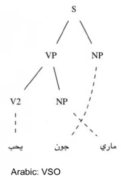

<head>
<link rel="stylesheet" type="text/css" href="resumen.css">
</head>

# Grammatical Framework
[Grammatical Framework](http://www.grammaticalframework.org/) (GF) es un lenguaje de programación diseñado para escribir gramáticas multilingües.
Inspirado por la construcción de compiladores se basa en la definición de una sintaxis abstracta y mapeos entre la sintaxis abstracta y lenguajes concretos.
Creado por [Aarne Ranta](http://www.cse.chalmers.se/~aarne/), Profesor de Ciencias de la Computación en la Universidad de Gotemburgo.
GF fue creado en 1998 en [Xerox Research Centre Europe](http://www.xrce.xerox.com/), Grenoble, en el proyecto Multilingual Document Authoring.

### GF es:
* Un lenguaje de propósito específico en gramáticas, como [YACC](http://dinosaur.compilertools.net/yacc/), [Bison](https://www.gnu.org/software/bison/), [Happy](https://www.haskell.org/happy/), [BNFC](http://bnfc.digitalgrammars.com/).
* Un lenguaje de programación funcional, como [Haskell](https://www.haskell.org/), [Lisp](https://en.wikipedia.org/wiki/Lisp_(programming_language)), [OCaml](http://ocaml.org/), [SML](http://www.smlnj.org/), [Scheme](http://schemers.org/).
* Una plataforma de desarrollo para gramáticas de lenguaje natural, como [LKB](http://moin.delph-in.net/LkbTop), [XLE](http://www2.parc.com/isl/groups/nltt/xle/), [Regulus](http://www.issco.unige.ch/en/research/projects/regulus/news.shtml).
* Un formalismo de gramáticas categoriales, como [ACG](http://calligramme.loria.fr/acg/), [CCG](http://openccg.sourceforge.net/).
* Un framework lógico, como [Agda](http://wiki.portal.chalmers.se/agda/pmwiki.php), [Coq](https://coq.inria.fr/), [Isabelle](http://www.cl.cam.ac.uk/research/hvg/Isabelle/), equipado con sintaxis concreta en adición a lógica.
* Una plataforma para traducción automática, como [Moses](http://www.statmt.org/moses/), [Apertium](https://es.wikipedia.org/wiki/Apertium).

### Licencias y disponibilidad

GF es de código abierto, con licencia [GPL](http://www.grammaticalframework.org/LICENSE) para el programa y [LGPL](http://www.grammaticalframework.org/LICENSE), [BSD](http://www.grammaticalframework.org/LICENSE) para las liberías. 
Está disponible en:

* Linux
* Mac OS X
* Windows
* Android (via Java)
* Javascript (via compilación)

## ¿Por qué gramáticas? 

### Tradición vs. GF

Tradicionalmente las gramáticas de lenguaje natural han sido vistas únicamente como parte de la teoría lingüística. 
GF sugiere un punto de vista más computacional, diferente al de las gramáticas tradicionales, el cual puede ser visto como "compilación de lenguaje natural", basado en los fundamentos de construcción de compiladores, teniendo en cuenta que los compiladores han sido un caso exitoso del uso de gramáticas.

### Precisión vs. robustez

La implementación de gramáticas ofrece una gran precisión en la traducción de lenguajes, teniendo como desventaja una pérdida en la cantidad de frases aceptadas. 
Los métodos estadísticos poseen, al contrario, mayor robustez pero con dificultades de conseguir la misma precisión que las gramáticas.
Tomando como trabajo la traducción de lenguaje natural a un lenguaje formal, como el de la lógica de primer orden y pensando además en una posible utilización de la herramienta en un ámbito educativo, parece oportuno priorizar la precisión de la traducción antes que la cobertura.
Para trabajar con la herramienta y lidiar con el hecho de no cubrir algunas oraciones de lenguaje natural, la implementación contará con algun método de completado de frases, al estilo tab-completion, para la construcción guiada de frases correctas para la gramática. 
Como trabajo futuro podría ser interesante construir un sistema híbrido, con el objetivo de unir la gramática definida con herramientas estadísticas y lograr así un sistema más robusto.

### GF como un lenguaje de programación

Las gramáticas en GF son vistas como programas declarativos capaces de:

* parsear
* generar
* traducir

GF es un lenguaje de programación avanzado y de alto nivel, permitiendo:

* Programación funcional: Una forma abstracta y compacta de escribir gramáticas.
* Funciones de alto orden.
* Tipos dependientes.
* Type-checking estático: Gramáticas compiladas.
* Pattern matching sobre constructores de datos.
* Sistema de modulos con herencia y modulos parametrizados.


### Resource Grammar Library (RGL)
GF cuenta además con una librería llamada [RGL](http://www.grammaticalframework.org/lib/doc/synopsis.html) (Resource Grammar Library) que provee inflexiones morfológicas y reglas sintácticas de varios lenguajes (actualmente 32), incluído el español.

La RGL maneja de manera inteligente la morfología de la mayoría de estos lenguajes.
Un caso donde puede aprovecharse esto es que la librería defina automáticamente las variaciones de una palabra analizando la morfología de la misma.

Por ejemplo, en inglés un verbo regular como talk, genera automáticamente sus diferentes inflexiones:

```
mkV : Str -> V
mkV "talk" => talk, talks, talked, talked, talking
```

Esto permite la construcción de un lexicón solo dando una única forma de cada palabra.

### Diagrama de funcionamento de GF

El funcionamento de GF está inspirado fuertemente por el funcionamento de compiladores. 

El modelo puede resumirse como un "Multi-source Multi-target compiler".


## Sintaxis abstracta y concreta

### Sintaxis abstracta

La sintaxis abstracta formaliza la semántica esencial que es común a todos los lenguajes.
Se construye mediante una gramática abstracta, definiendo los posibles árboles de sintaxis abstractos (AST).

En la sintaxis abstracta se definen:

* Categorías (cat): Que serán los tipos de los AST.

* Funciones (fun) sobre las categorías definidas. Estas funciones son las que definen los AST.

### Sintaxis concreta
La sintaxis concreta es definida mediante mapeos entre la sintaxis abstracta y diferentes lenguajes concretos.
Con estas herramientas es posible parsear sentencias en algún lenguaje definido por la gramática concreta, y además linealizar desde un árbol abstracto, es decir, generar sentencias en algún lenguaje concreto.
GF permite una gramática abstracta en conjunto a varias gramáticas concretas, de esta manera posibilitando la traducción entre distintos lenguajes.

En la sintaxis concreta se definen:

* Categorías de linealización (lincat): Son los tipos concretos que se le asignan a cada categoría de la sintaxis abstracta. Por ejemplo, strings, records y tables.

* Linealización (lin) de los AST, teniendo en cuenta las categorías de linealización.

#### Un caso de uso pequeño
Ejemplo con expresiones aritméticas en Java:


Se desea compilar una expresión aritmética en Java a código binario de JVM. Para ello existe una sintaxis abstracta común para ambas notaciones y es posible generar un AST desde la expresión en Java y  además es posible generar una expresión en JVM desde el AST.
Se logra de esta manera una traducción desde Java a JVM.

Sintaxis Abstracta

	cat Exp ;
	fun Add : Exp -> Exp -> Exp ;

Sintaxis concreta (Java)

	lincat Exp = Str ;
	lin Add x y = x ++ "+" ++ y ;


Sintaxis concreta (JVM bytecode)

	lincat Exp = Str ;
	lin Add x y = x ++ y ++ "01100000" ;


## Compilando lenguaje natural

Para traducir entre varios lenguajes, normalmente sería necesario una traducción independiente para cada par de lenguajes.


Sin embargo, con GF la sintaxis abstracta juega el papel de "Interlingua", donde solo es necesario traducir entre cada lenguaje y la Interlingua.
A modo de ejemplo, si se desea traducir desde Español a Inglés, debe traducirse primero desde Español a la Interlingua, y luego desde la Interlingua al Inglés.
El caso inverso, es decir, traducir desde Inglés a Español, funciona de la misma manera.
Se puede decir entonces que con GF es posible realizar una compilación y decompilación de la misma manera.


### ¿Cómo se logra la traducción de lenguaje natural?

Sintaxis Abstracta:

```
fun Pred : NP -> VP -> S
fun Compl : V2 -> NP -> VP
```


Sintaxis concreta: (SVO)

```
lin Pred s vo = s ++ vo
lin Compl v o = v ++ o
```

Sintaxis concreta: (SOV)

```
lin Pred s vo = s ++ vo
lin Compl v o = o ++ v
```


### Records y tables

GF provee records y tables, además de strings, para definir la sintaxis concreta.



Se necesitan records para (VSO). No hay una manera de producir la linealización de la frase sin separar al predicado en dos partes (verbo y objeto), mediante un record.

Sintaxis concreta: (VSO)

```
lin Pred s vo = vo.verb ++ s ++ vo.obj
lin Compl v o = {verb = v ; obj = o}
```

Las modificaciones de una misma palabra o frase, como género, número, persona o polaridad requieren del uso de parámetros y tables.

Por ejemplo, en ingles un verbo puede variar según los siguientes modificadores de tiempo y persona.

```
param P = Inf | Sg3P | Past | PastPart | PresPart
```

Uso de tables:

```
lin Love = table {
    Inf => "love";
    Sg3P => "loves";
    Past | PastPart => "loved";
    PresPart => "loving";
}
```

### Concordancia en sintaxis concreta

Es importante notar que la sintaxis abstracta permanece sin cambios.

```
lin She = {
    s = table {Nom => "she" ; Acc => "her" };
    a = Sg3P;
}
```

```
lin Pred s vo = s.s ! Nom ++ vo ! s.a
lin Compl v o = table { a => v ! a ++ o.s ! acc };
```

```
Ejemplo: she loves her
```

### Parallel multiple context free grammars

GF usa internamente [Parallel multiple context free grammars (PMCFG)](http://www.sciencedirect.com/science/article/pii/030439759190374B), definidas como gramáticas ligeramente sensitivas al contexto. Lo que en GF puede pensarse de manera simple como gramáticas sobre tuplas. Un hecho interesante sobre PMCFG es que, al igual que las CGF, permite parsing polinomial. 

### Abstracción multilingüe

* Sintaxis abstracta
    * Estructura de árboles: Constituyentes y semántica.
* Sintaxis concreta
    * Palabras
    * Orden de palabras
    * Inflección
    * Concordancia

## Trabajo a realizar

El trabajo consiste en lograr traducir un fragmento de lenguaje natural a un lenguaje simbólico de lógica de primer orden.
Se tomó como motivación producir fórmulas lógicas para el programa [Sat](https://github.com/manugunther/sat).

Una de las ventajas de GF es que permite realizar una modularización paramétrica mediante funtores, los cuales admiten la definición de una gramática incompleta y la posibilidad de completarla con un lexicón. El objetivo es escribir una gramática incompleta de la manera más general posible, que abarque las diferentes construcciones del lenguaje formal de la lógica y luego poder instanciarla con diferentes lexicones, entre ellos, el de figuras geométricas de Sat.

### Motivación al trabajo

El primer desafío que se encuentra en el aprendizaje de la lógica está dado por la barrera lingüística impuesta por el lenguaje simbólico y artificial de la misma. Consecuentemente parece razonable comenzar un curso de lógica con la traducción de sentencias expresadas en lenguaje natural (digamos español) a su correspondiente formulación símbolica en la lógica en cuestión (proposicional, de primer orden, etc.). Las dificultades de esta traducción vienen dadas, entre otras, por la ambigüedad de la sentencia en lenguaje natural y por la puntillosidad con la que se deben construir las fórmulas lógicas.

El objetivo de este proyecto es extender el programa Sat con un módulo que permita a estudiantes la exploración de la traducción de lenguaje natural a fórmulas de lógica de primer orden y viceversa. De esta manera, la/el estudiante puede ir familiarizándose con la escritura formal a través de ejemplos que ella/el construye y contrastar su formalización con todas las traducciones posibles y viceversa. Esta traducción se basará teóricamente en la formalización de lenguaje natural utilizando [teoría de tipos propuesta por Ranta](https://books.google.com.ar/books?hl=sv&lr=&id=A5m13eGOcqYC&oi=fnd&pg=PA1&dq=aarne+ranta&ots=KjH2Put2Wa&sig=J__Gk-RZctvQzSqJBDVXyngpY1Y&redir_esc=y#v) y para la implementación se utilizará el Grammatical Framework.


## Trabajo realizado hasta el momento

### Gramática abstracta

Para construir la gramática abstracta es necesario primero definir categorías, que serán los tipos de los AST, y luego funciones sobre estas categorías.
Las presentadas a continuación son inspiradas por el trabajo de A. Ranta: [Translating between Language and Logic: What Is Easy and What Is Difficult](https://www.semanticscholar.org/paper/Translating-between-Language-and-Logic-What-Is-Eas-Ranta/581281bb6292814ce285dc1de82a9785fdac2b5d).


#### Base

Una lista de las categorías básicas de la gramática abstracta definida hasta el momento.

| Categorías    | Descripción                     | Ejemplos                          |
| ------------- |:-------------------------------:|:---------------------------------:|
|    Prop       | proposición, compleja o atomica | A es rojo y B es grande           |
|    Atom       | propisición atómica             | A es rojo                         |
|    AtomEqual  | igualdad (atómica)              | A es igual a B                    |
|    Pred1      | Predicado unario                | es rojo                           |
|    Pred2      | Predicado binario               | está arriba de                    |
|    Ind        | termino indivual                | A                                 |
|    Var        | variable de cuantificación      | x                                 |
|    Fun1       | función unaria                  | cuadrado (aritmética) e.g x^2        |
|    Fun2       | función binaria                 | suma (aritmética) e.g x+y            |
|    Conj       | conjunción                      | y, o                              |


Los constructores básicos de árboles abstractos, definidos en la gramática abstracta como funciones:

| Funciones                                  | Ejemplos                           |
| -------------------------------------------|:----------------------------------:|
|  PAtom  : Atom  -> Prop                    | A es cuadrado                      |
|  PNeg   : Prop  -> Prop                    | no es el caso que A **sea** grande |
|  PConj  : Conj  -> Prop -> Prop -> Prop    | A es grande y A es rojo            |
|  PImpl  : Prop  -> Prop -> Prop            | si A es grande entonces A es rojo  |
|  PUniv1  : Var -> Prop -> Prop             | < ∀x : : Rojo.x >                  |
|  PExist1 : Var -> Prop -> Prop             | < ∃x : : Rojo.x >                  | 
|  PUniv2  : Var -> Prop -> Prop -> Prop     | < ∀x : Tr.x : Rojo.x >             | 
|  PExist2 : Var -> Prop -> Prop -> Prop     | < ∃x : Tr.x : Rojo.x >             |  
|  IVar   : Var -> Ind                       |  x                                 |
|  APred1 : Pred1 -> Ind -> Atom             |  A es grande                       |
|  APred2 : Pred2 -> Ind -> Ind -> Atom      |  A está arriba de B                |
|  AEqual : Ind -> Ind -> AtomEqual          |  A is igual a B                    |
|  IFun1  : Fun1 -> Ind -> Ind               |  el cuadrado de x                  |
|  IFun2  : Fun2 -> Ind -> Ind -> Ind        |  la sum de A y B                   |
|  VString : String -> Var                   |  x                                 |
|  CAnd, COr : Conj                          |  y, o                              |

Donde es importante notar lo siguiente:

* PUniv1 y PExist1 definen árboles abstractos para cuantificación con rango true.
* PUniv2 y PExist2 definen árboles abstractos para cuantificación con rango que dependa de alguna proposición.
* No se linealizan al castellano los árboles creados por PUniv ni PExist. solo se usarán para linealizar al lenguaje simbólico de lógica de primer orden.
* Las funciones que se usarán para parsear cuantificación de lenguaje natural son agregadas en la extensión.


#### Extensión

Defino nuevas categorías y funciones que extienden las dadas anteriormente, que serán útiles para aceptar frases más naturales del español.

Por el momento solo fueron añadidas:

* Negación de atómicas: ej: A no es grande
* Negación de igualdad: ej: A es distinto de B
* Cuantificación in-situ: ej: Todos los triangulos rojos son grandes. Sin embargo por ahora solo se puede parsear: "Todas las figuras triangulares rojas son grandes". (Forma, color y tamaño son adjetivos modificadores de Figura).

| Categoría | Descripción               | Ejemplos                  |
|------------|---------------------------|---------------------------|
| Kind       | Dominio de cuantificación | figura, figura triangular |


| Funciones                              | Ejemplos                   |
|----------------------------------------|------------------------------|
| PNegAtom: Atom -> Prop                 | A no es rojo                 |
| PNegEqual : Ind -> Ind -> Prop         | A es distinto de B           |
| UnivIS: Var -> Kind -> Pred1 -> Prop   | Cada figura roja es grande   |
| ExistIS : Var -> Kind -> Pred1 -> Prop | Alguna figura roja es grande |
| ModKind : Kind -> Pred1 -> Kind        | Figura roja                  |

Nota: Pienso que debería quitar Var de UnivIS y ExistIS, y generar las variables nuevas al momento de traducir arboles generados por UnivIS, ExistIS a PUniv, PExist respectivamente.

#### Lexicón

| Funciones                                 | Descripción   |
|-------------------------------------------|---------------|
| Rojo, Azul, Verde : Pred1                 | Color         |
| Chico, Mediano, Grande: Pred1             | Tamaño        |
| Triangulo, Cuadrado, Circulo : Pred1      | Forma         |
| Izquierda, Derecha, Arriba, Abajo : Pred2 | Posición      |
| Figura : Kind                             | Elemento base |

#### Funciones de transformación

Son las encargadas de realizar una transformación de los árboles abstractos parseados en lenguaje natural.

Hasta el momento se utilizan para mapear cuantificación in-situ a arboles generados por PUniv o PExist.
Es necesario para ello transformar los árboles de tipo Kind a una conjunción de predicados.

| Funciones                        | Descripción                                                   |
|----------------------------------|---------------------------------------------------------------|
| UnivIStoP : Prop -> Prop         | Transformación de cuantificación universal in-situ a PUniv    |
| ExistIStoP : Prop -> Prop        | Transformación de cuantificación existencial in-situ a PExist |
| KindToProp : Kind -> Var -> Prop | Transformación de Kind a conjunción de predicados             |


## Bibliografía

1. [GF webpage](http://www.grammaticalframework.org/)
2. [Libro: Grammatical Framework: Programming with Multilingual Grammars](http://www.grammaticalframework.org/gf-book/)
3. [GF tutorial](http://www.grammaticalframework.org/doc/gf-lrec-2010.pdf)
4. [Google Tech Talk, Aarne Ranta](https://www.youtube.com/watch?v=x1LFbDQhbso)
5. [Paper: Translating between Language and Logic: What Is Easy and What Is Difficult, Aarne Ranta, CADE2011](https://www.semanticscholar.org/paper/Translating-between-Language-and-Logic-What-Is-Eas-Ranta/581281bb6292814ce285dc1de82a9785fdac2b5d)
6. [Slides: Translating between Language and Logic: What Is Easy and What Is Difficult, Aarne Ranta, CADE2011](http://www.grammaticalframework.org/~aarne/cade-talk.pdf)


